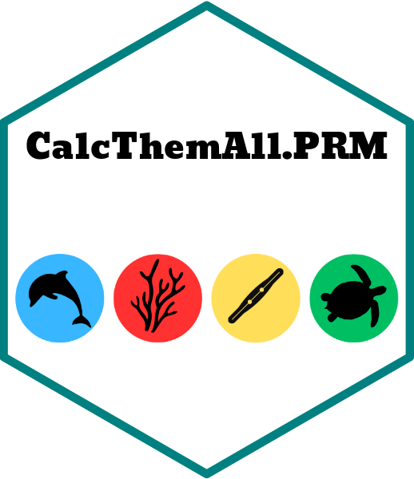

<!-- README.md is generated from README.Rmd. Please edit that file -->

```{r, include = FALSE}
knitr::opts_chunk$set(
  collapse = TRUE,
  comment = "#>",
  fig.path = "man/figures/README-",
  out.width = "100%"
)
```

# CatchThemAll.PRM </a>

<!-- badges: start -->
<!-- badges: end -->

This package provides code for estimating combined toxicity of measured pollutants using their Species Sensitivty Distibutions (SSDs) in a multi-substance potentially affected fraction approach. The resulting value is a estimate of the percentage of species impacted by the measured pollutants, a value which is referred to in this package as the **Pollutant Risk Metric (PRM)**. This is based on the the Queensland Department of Environment and Science Water Quality & Investigation's [method](https://www.publications.qld.gov.au/dataset/method-development-pesticide-risk-metric-baseline-condition-of-waterways-to-gbr/resource/c65858f9-d7ba-4aef-aa4f-e148f950220f) used in the Reef 2050 Water Quality Improvement Plan, with the main difference being the ability to add different pollutants to be measured. These PRM values can be compared to the three categories of ecosystem condition, as defined in the Australian and New Zealand Guidelines for Fresh & Marine Water Quality seen in the table below.

```{r out.width = '80%', echo = FALSE}
knitr::include_graphics("man/figures/guidelines_table.png")
```

The Pollutant Risk metric is an adaptable version of the pesticide risk metric that allows for the addition of new pollutants provided SSD information is available and will hopefully be more widely useful.

## Installation

You can install the development version of CatchThemAll.PRM from [GitHub](https://github.com/) with:

``` r
# install.packages("devtools")
devtools::install_github("AlexWaterboyBezzina/CatchThemAll.PRM")
```
# How To Catch Them All (Calculate PRM Quick Version)

The process for calculating PRM estimates using this method is split into **4 main parts/functions:**

1. Adding new pollutant SSD information to the metric `add_your_own_pollutant()`
2. Treating Limit of Reporting (LOR) concentration values `treat_LORs_all_data()`
3. Calculating daily average PRM estimates `calculate_daily_average_PRM()`
4. Calculating wet season average PRM estimates `calculate_wet_season_average_PRM()`

An example of how to run this package is provided below using the included `Kanto_pollutants` concentration data.

```{r example_1, echo=TRUE, warning=FALSE}
library(CatchThemAll.PRM)
#1.Add new pollutants to pollutant_info table
pollutant_info <- add_your_own_pollutant(pollutants = #adding multiple new pollutants
                                           c("Poison", "Acid", "Sludge"),
                                         relative_LORs = c(0.03, 0.01, 0.5), 
                                         pollutant_types = c("Ghost", "Bug", "Poison"),
                                         distribution_types = c("Log-Normal", "Log-Logistic
                                                                Log-Logistic", "Burr Type III"),
                                         scales = c(0.3, 0.002, 2),
                                         scale_2s = c(NA, 0.04, NA), 
                                         shape_locations = c(1, 0.07, 3),
                                         shape_location_2s = c(NA, 0.14, 2.3),
                                         weights = c(NA, 0.08, NA))

#2.Treat LOR Values
Kanto_pollutants_LOR_treated <- treat_LORs_all_data(raw_data = Kanto_pollutants,
pollutant_info = CatchThemAll.PRM::pollutant_info, treatment_method = "WQI")

#3.Calculate Daily Average PRM
Kanto_daily_PRM <- calculate_daily_average_PRM(LOR_treated_data = Kanto_pollutants_LOR_treated)
head(Kanto_daily_PRM)

Lavendar_Town_2017_2018_PRM <- Kanto_daily_PRM %>%
 dplyr::filter(.data$`Sampling Year` ==  "2017-2018" &  .data$`Site Name` == "Lavendar Town")

plot <- plot_daily_PRM(daily_PRM_data = Lavendar_Town_2017_2018_PRM,
               wet_season_start = "2017-10-02", #start date of the wet season or high risk window
                                                #this is optional and can be removed with = NULL
               wet_season_length = 182, #length of wet season or high risk window
               PRM_group = "PSII Herbicide PRM") #PRM group to plot, for all PRM = "Total PRM
```

```{r plot, out.width = '80%', echo = FALSE}
knitr::include_graphics("man/figures/daily_plot.png")
```

```{r example_2, echo=TRUE, warning=FALSE}
#4.Calculate Wet Season Average PRM
Kanto_wet_season_Total_PRM <- calculate_wet_season_average_PRM(daily_PRM_data = Kanto_daily_PRM, PRM_group = "Total PRM") #this calculates the wet season average PRM for all pollutant groups
                         #to calculate for a specific group define it in "PRM_group ="
head(Kanto_wet_season_Total_PRM)

```


## Disclaimer

Information is from several sources and, as such, does not necessarily represent government or departmental policy. While every care is taken to ensure the accuracy of this information, the Department of Environment and Science makes no representations or warranties relating to  accuracy, reliability, completeness, currency or suitability for any particular purpose and disclaims all responsibility and all liability (including without limitation, liability in negligence) for all expenses, losses, damages (including indirect or consequential damage) and costs that might be incurred as a result of any use or of reliance on the information and calculated data in any way and for any reason.

## Citation

**R Package:**

*Bezzina A, Neelamraju C, Strauss J, Kaminski H, Roberts C, Glen J, Dias F. 2022. CatchThemAll.PRM: Pesticide Risk Metric Calculations. R package. Water Quality Monitoring & Investigations, Department of Environment and Science, Queensland Government. https://github.com/AlexWaterboyBezzina/CatchThemAll.PRM*

**Methods Behind Pesticide Risk Metric:**

*Warne MStJ, Neelamraju C, Strauss J, Smith RA, Turner RDR, Mann RM. 2020. Development of a method for estimating the toxicity of pesticide mixtures and a Pesticide Risk Baseline for the Reef 2050 Water Quality Improvement Plan. Brisbane: Department of Environment and Science, Queensland Government.*
