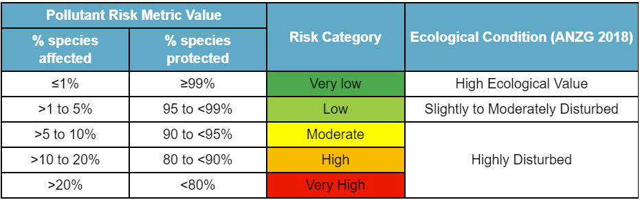
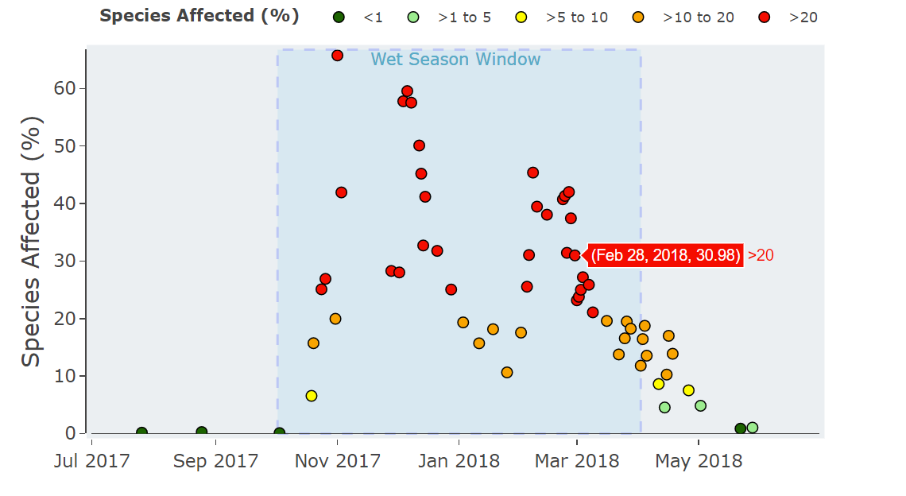

<!-- README.md is generated from README.Rmd. Please edit that file -->

# CalcThemAll.PRM </a>

<!-- badges: start -->

[](https://github.com/AlexWaterboyBezzina/CalcThemAll.PRM/actions/workflows/R-CMD-check.yaml)
[](https://CRAN.R-project.org/package=CalcThemAll.PRM)
<!-- badges: end -->

This package provides code for estimating the combined toxicity of
measured pesticides using their Species Sensitivity Distributions (SSDs)
in a multi-substance, potentially affected fraction approach. The
resulting value is an estimate of the percentage of species impacted by
the measured pesticides; a value which is referred to in this package as
the **Pesticide Risk Metric (PRM)**. This is based on the Queensland
Department of Environment and Science Water Quality & Investigation’s
[method](https://www.publications.qld.gov.au/dataset/method-development-pesticide-risk-metric-baseline-condition-of-waterways-to-gbr/resource/c65858f9-d7ba-4aef-aa4f-e148f950220f)
used in the Reef 2050 Water Quality Improvement Plan. The main
difference is the ability to add different pesticides to be measured
provided they have one of the following SSD distributions:

- Burr_Type_III
- Gamma
- Inverse Weibull
- Log Gumbel
- Log Logistic
- Log Logistic Log Logistic
- Log Normal
- Log Normal Log Normal

These PRM values can be compared to the three categories of ecosystem
condition, as defined in the Australian and New Zealand Guidelines for
Fresh & Marine Water Quality seen in the table below.



## Installation

The easiest way to install this package is from CRAN

``` r
install.packages("CalcThemAll.PRM")
```

You can install the development version of CalcThemAll.PRM from
[GitHub](https://github.com/) with:

``` r
# install.packages("devtools")
devtools::install_github("AlexWaterboyBezzina/CalcThemAll.PRM")
```

# How To Calc Them All (Calculate PRM Quick Version)

The process for calculating PRM estimates using this method is split
into **4 main parts/functions:**

1.  Adding new pesticide SSD information to the metric
    `add_your_own_pesticide()`
2.  Treating Limit of Reporting (LOR) concentration values
    `treat_LORs_all_data()`
3.  Calculating daily average PRM estimates
    `calculate_daily_average_PRM()`
4.  Calculating wet season average PRM estimates
    `calculate_wet_season_average_PRM()`

An example of how to run this package is provided below using the
included `Canto_pesticides` concentration data.

``` r
library(CalcThemAll.PRM)
#1.Add new pesticides to pesticide_info table
pesticide_info <- add_your_own_pesticide(pesticides = #adding multiple new pesticides
                                           c("Poison", "Acid", "Sludge"),
                                         relative_LORs = c(0.03, 0.01, 0.5), 
                                         pesticide_types = c("Ghost", "Bug", "Poison"),
                                         distribution_types = c("Log-Normal", "Log-Logistic
                                                                Log-Logistic", "Burr Type III"),
                                         scales = c(0.3, 0.002, 2),
                                         scale_2s = c(NA, 0.04, NA), 
                                         shape_locations = c(1, 0.07, 3),
                                         shape_location_2s = c(NA, 0.14, 2.3),
                                         weights = c(NA, 0.08, NA))

#2.Treat LOR Values
Canto_pesticides_LOR_treated <- treat_LORs_all_data(raw_data = Canto_pesticides,
pesticide_info = CalcThemAll.PRM::pesticide_info, treatment_method = "WQI")

#3.Calculate Daily Average PRM
Canto_daily_PRM <- calculate_daily_average_PRM(LOR_treated_data = Canto_pesticides_LOR_treated)
head(Canto_daily_PRM)
#> # A tibble: 6 × 7
#>   `Site Name`    `Sampling Year` Date       `Total PRM` `Insecticide PRM`
#>   <chr>          <chr>           <chr>            <dbl>             <dbl>
#> 1 Celestial City 2017-2018       2017-07-03       22.9      0.000126     
#> 2 Celestial City 2017-2018       2017-07-10        7.34     0.0000172    
#> 3 Celestial City 2017-2018       2017-07-18       47.0      0.0145       
#> 4 Celestial City 2017-2018       2017-07-24       14.6      0.00851      
#> 5 Celestial City 2017-2018       2017-07-30       17.2      0.00533      
#> 6 Celestial City 2017-2018       2017-08-08        5.28     0.00000000193
#> # ℹ 2 more variables: `Other Herbicide PRM` <dbl>, `PSII Herbicide PRM` <dbl>

Violet_Town_2017_2018_PRM <- Canto_daily_PRM %>%
 dplyr::filter(.data$`Sampling Year` ==  "2017-2018" &  .data$`Site Name` == "Violet Town")

plot <- plot_daily_PRM(daily_PRM_data = Violet_Town_2017_2018_PRM,
               wet_season_start = "2017-10-02", #start date of the wet season or high risk window
                                                #this is optional and can be removed with = NULL
               wet_season_length = 182, #length of wet season or high risk window
               PRM_group = "PSII Herbicide PRM") #PRM group to plot, for all PRM = "Total PRM
```



``` r
#4.Calculate Wet Season Average PRM
Celestial_City_2019_2020_daily_PRM <- Canto_daily_PRM %>% 
  dplyr::filter(`Site Name` == "Celestial City" & `Sampling Year` == "2019-2020")
#This calculation can take a few minutes so one site & sampling year is used in this example

CC2019_2020_wet_season_Total_PRM <- calculate_wet_season_average_PRM(daily_PRM_data = Celestial_City_2019_2020_daily_PRM, PRM_group = "Total PRM") 
#this calculates the wet season average PRM for all pesticide groups in one total value
#to calculate for a specific group define it in "PRM_group ="

CC2019_2020_wet_season_Total_PRM
#> # A tibble: 1 × 3
#>   `Site Name`    `Sampling Year` `Total PRM`
#>   <chr>          <chr>                 <dbl>
#> 1 Celestial City 2019-2020              26.7
```

## Disclaimer

Information is from several sources and, as such, does not necessarily
represent government or departmental policy. While every care is taken
to ensure the accuracy of this information, the Department of
Environment and Science makes no representations or warranties relating
to accuracy, reliability, completeness, currency or suitability for any
particular purpose and disclaims all responsibility and all liability
(including without limitation, liability in negligence) for all
expenses, losses, damages (including indirect or consequential damage)
and costs that might be incurred as a result of any use or of reliance
on the information and calculated data in any way and for any reason.

## Citation

**R Package:**

*Bezzina A, Neelamraju C, Strauss J, Kaminski H, Roberts C, Glen J, Dias
F. 2022. CalcThemAll.PRM: Pesticide Risk Metric Calculations. R package.
Water Quality Monitoring & Investigations, Department of Environment and
Science, Queensland Government.
<https://github.com/AlexWaterboyBezzina/CalcThemAll.PRM>*

**Methods Behind Pesticide Risk Metric:**

*Warne MStJ, Neelamraju C, Strauss J, Smith RA, Turner RDR, Mann RM.
2020. Development of a method for estimating the toxicity of pesticide
mixtures and a Pesticide Risk Baseline for the Reef 2050 Water Quality
Improvement Plan. Brisbane: Department of Environment and Science,
Queensland Government.*
