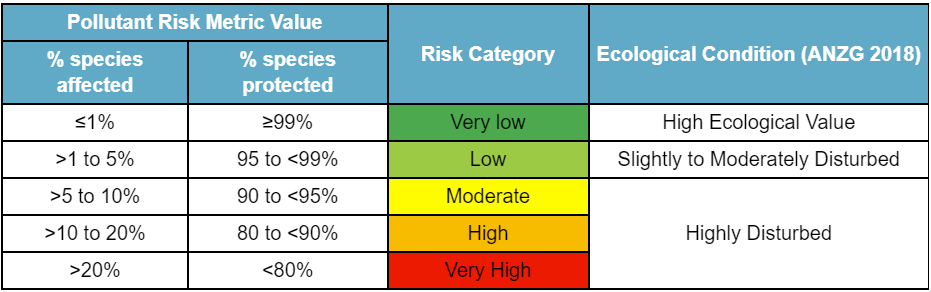

```{r, include = FALSE}
knitr::opts_chunk$set(
  collapse = TRUE,
  comment = "#>"
)
```

## The Pollutant Risk Metric (PRM)

This package provides code for estimating combined toxicity of measured pollutants using their Species Sensitivty Distibutions (SSDs) in a multi-substance potentially affected fraction approach. The resulting value is a estimate of the percentage of species impacted by the measured pollutants, a value which is referred to in this package as the **Pollutant Risk Metric (PRM)**. This is based on the the Queensland Department of Environment and Science Water Quality and Investigation's [method](https://www.publications.qld.gov.au/dataset/method-development-pesticide-risk-metric-baseline-condition-of-waterways-to-gbr/resource/c65858f9-d7ba-4aef-aa4f-e148f950220f) (refereed to in this package as  the WQI Method) used in the Reef 2050 Water Quality Improvement Plan, with the main difference being the ability to add different pollutants to be measured. These PRM values can be compared to the three categories of ecosystem condition, as defined in the Australian and New Zealand Guidelines for Fresh & Marine Water Quality seen in the table below:

```{r out.width = '70%', echo = FALSE}

```

# How To Catch Them All

## Adding Your Own Pollutants

One of the key functions of this package is **the ability to add your own pollutants** to the risk metric, provided that SSD information is available. This can be done by editing the "pollutant_info" table which is included in this package and is used as a look-up table for many of the later functions. You can add your pollutants provided you know the SSD distribution type, scale parameters, shape/location parameters, and weight parameter if required. Depending on how/if LOR replacement is needed relative LOR replacement values for each new pollutant will be required, and if the impact of specific pollutant types is of interest a pollutant type parameter should be provided. The "add_your_own_pollutant" function appends new pollutant information to the "pollutant_info" table as seen below

```{r add_your_own_pollutant, echo=TRUE, warning=FALSE}
library(CatchThemAll.PRM)
library(DT)
pollutant_info <- CatchThemAll.PRM::pollutant_info #the original 22 pollutants
datatable(pollutant_info)

pollutant_info <- add_your_own_pollutant(pollutants = "Poison", #adding one new pollutant
                                         relative_LORs = 0.023, pollutant_types = "Poison",
                                         distribution_types = "Log-Normal", scales = 0.09,
                                         shape_locations = 0.014)
datatable(pollutant_info)

pollutant_info <- add_your_own_pollutant(pollutants = #adding multiple new pollutants
                                           c("Poison", "Acid", "Sludge"),
                                         relative_LORs = c(0.03, 0.01, 0.5), 
                                         pollutant_types = c("Ghost", "Bug", "Poison"),
                                         distribution_types = c("Log-Normal", "Log-Logistic
                                                                Log-Logistic", "Burr Type III"),
                                         scales = c(0.3, 0.002, 2),
                                         scale_2s = c(NA, 0.04, NA), 
                                         shape_locations = c(1, 0.07, 3),
                                         shape_location_2s = c(NA, 0.14, 2.3),
                                         weights = c(NA, 0.08, NA))
datatable(pollutant_info)

```

It is **not necessary to remove unmeasured pollutants** from the "pollutant_info" table due to the independent action assumption in the methods, however **if they are not removed they will still require an empty column** in the concentration data set and **which pollutants are used in the metric should be clearly documented** for transparency. 

## Treating Limit Of Reporting Values (LORs)

How to treat Limit of Reporting values is a common issue in lab concentration measurements. This package provides two ways to treat LORs using the "treat_LORs_all_data" function. The first is the method created by the Department of Environment and Science Queensland Water Quality Investigations outlined in the methods document above and is refereed to as the **"WQI"** method. This method looks for the first above LOR concentration recorded for each sampling year or other recurring time interval and replaces every LOR before this reading with a negligible value and every LOR value after with the pollutants LOR replacement value defined in the "pollutant_info" table. The second method is the replacing all LOR values with zero and is refereed to as the **"zero"** method. The "treat_LORs_all_data" function requires a concentration data set with **a column that matches each pollutant name in the "pollutant_info" table and a "Site Name" and "Date" column**, and how to use it can be seen below with the example "Kanto_pollutants" concentration data provided in the package.

```{r treat_LORs_all_data, echo=TRUE, warning=FALSE}

datatable(Kanto_pollutants) #Kanto pollutant concentrations before LOR treatment

Kanto_pollutants_LOR_treated <- treat_LORs_all_data(raw_data = Kanto_pollutants, #this is the pollutant concentration dataset to be treated
pollutant_info = CatchThemAll.PRM::pollutant_info, #this specifies the pollutant info look-up table
treatment_method = "WQI") #this selects the LOR treatment method

datatable(Kanto_pollutants_LOR_treated) #Kanto pollutant concentrations after treatment, LORs should be replaced with either 0.0000001 or LOR replacement value

```


## Calculate Daily Average PRM

Once your "pollutant_info" table has all your required pollutants and LOR values have been treated **we can begin the calculating daily average PRM values**, the main focus of this package! The "calculate_daily_average_PRM" function calculates a daily average PRM value for each day that pollutant concentration data is provided in a "Total PRM" column. It also calculates daily average PRM values for each pollutant_type in the "pollutant_info" table in a column named after the type followed by " PRM", for example "PSII PRM". This function is designed to run with a data frame exported from the "treat_LORs_all_data" function. However if you skipped the treat LORs step the input data frame needs all the same columns and an additional column for "Sampling Year". An example of the function is shown below

```{r calculate_daily_average_PRM, echo=TRUE, warning=FALSE}
head(Kanto_pollutants_LOR_treated) #Kanto pollutant concentrations after LOR treatment

#calculate daily PRM
Kanto_daily_PRM <- calculate_daily_average_PRM(LOR_treated_data = Kanto_pollutants_LOR_treated)
head(Kanto_daily_PRM)

```

### Plot Daily Average PRM

This package also contains a function to **plot daily PRM for a single site and sampling year**. "plot_daily_PRM" creates an interactive plotly plot for a single PRM group/type colour coded to match the PRM legend table shown at the beginning of this vignette.

```{r plot_daily_PRM, echo=TRUE, warning=FALSE}
#filter daily PRM data for a single site and sampling year
Lavendar_Town_2017_2018_PRM <- Kanto_daily_PRM %>%
 dplyr::filter(.data$`Sampling Year` ==  "2017-2018" &  .data$`Site Name` == "Lavendar Town")

plot_daily_PRM(daily_PRM_data = Lavendar_Town_2017_2018_PRM,
               wet_season_start = "2017-10-02", #start date of the wet season or high risk window
                                                #this is optional and can be removed with = NULL
               wet_season_length = 182, #length of wet season or high risk window
               PRM_group = "PSII Herbicide PRM") #PRM group to plot, for all PRM = "Total PRM"

```


## Calculate Wet Season Average PRM

The final part of this package is for those interested in **estimating a PRM value for a reoccurring large window of time like a wet season** or a period of high pollution risk. It involves using the calculated daily average PRM values within a wet season window or high risk window to generate a single mean value using **multiple imputation** to fill in non sampling days. More detail about this can be found in the WQI methods document. For example if looking at wet seasons, if 4 sampling years worth of concentration data is provided there will be a single wet season PRM for each year. This is done using the "calculate_wet_season_average_PRM" function and at this time is only capable of calculating one pollutant_type at a time or "Total PRM"" being all pollutant groups together.

```{r calculate_wet_season_PRM, echo=TRUE, warning=FALSE}
Kanto_wet_season_Total_PRM <- calculate_wet_season_average_PRM(daily_PRM_data = Kanto_daily_PRM, PRM_group = "Total PRM") #this calculates the wet season average PRM for all pollutant groups

head(Kanto_wet_season_Total_PRM)

Kanto_wet_season_PSII_PRM <- calculate_wet_season_average_PRM(daily_PRM_data = Kanto_daily_PRM, PRM_group = "PSII Herbicide PRM") #this calculates the wet season average PRM for only PSII pollutants

head(Kanto_wet_season_PSII_PRM)

```

## Disclaimer

Information is from several sources and, as such, does not necessarily represent government or departmental policy. While every care is taken to ensure the accuracy of this information, the Department of Environment and Science makes no representations or warranties relating to  accuracy, reliability, completeness, currency or suitability for any particular purpose and disclaims all responsibility and all liability (including without limitation, liability in negligence) for all expenses, losses, damages (including indirect or consequential damage) and costs that might be incurred as a result of any use or of reliance on the information and calculated data in any way and for any reason.

## Citation

**R Package:**

*Bezzina A, Neelamraju C, Strauss J, Kaminski H, Roberts C, Glen J, Dias F. 2022. CatchThemAll.PRM: Pesticide Risk Metric Calculations. R package. Water Quality Monitoring & Investigations, Department of Environment and Science, Queensland Government. https://github.com/AlexWaterboyBezzina/CatchThemAll.PRM*

**Methods Behind Pesticide Risk Metric:**

*Warne MStJ, Neelamraju C, Strauss J, Smith RA, Turner RDR, Mann RM. 2020. Development of a method for estimating the toxicity of pesticide mixtures and a Pesticide Risk Baseline for the Reef 2050 Water Quality Improvement Plan. Brisbane: Department of Environment and Science, Queensland Government.*
